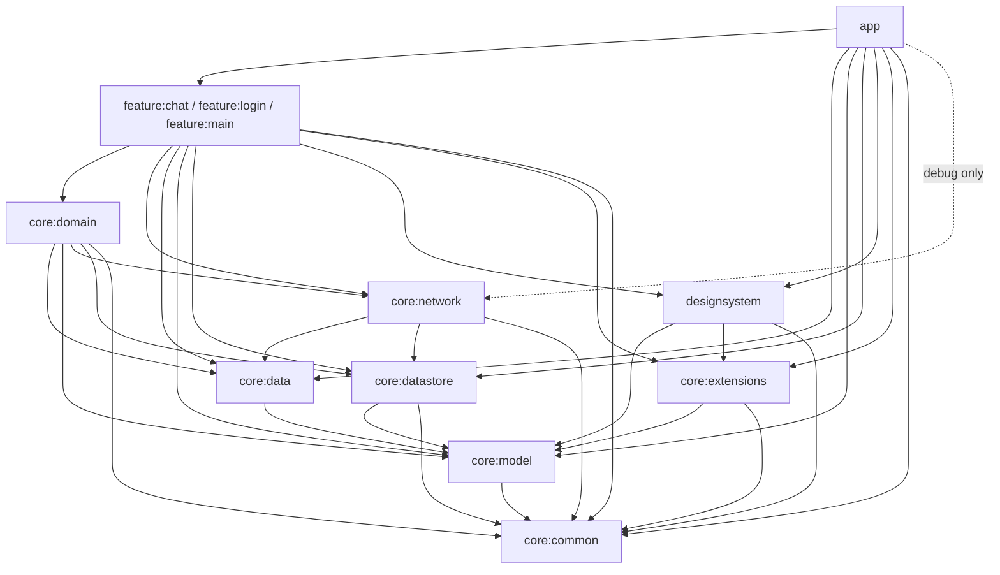
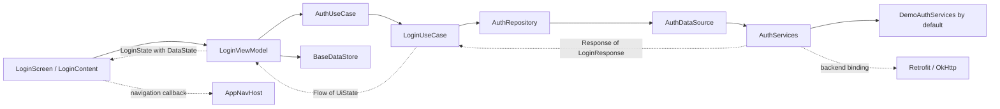

# Android Ramu

A runnable Android skeleton following Field Officer v2's **Land feature architecture**: multi-module Compose UI, MVVM, Hilt, typed navigation, and a repository/use-case pipeline. It opens directly into Hermes chat with persistent server conversation history. Demo login and logout modules remain available as reusable skeleton features.

Start here for project orientation. [AGENTS.md](AGENTS.md) defines architecture and editing rules; each module guide explains package ownership.

## Quick start

1. Open the project in Android Studio and select `stagingDebug`.
2. Install Android SDK 37 and use a compatible Gradle JDK. Android Studio's bundled JBR works; shared Java/Kotlin bytecode targets Java 17.
3. Set the SDK location in untracked `local.properties`, then run the checked-in wrapper:

```sh
./gradlew :app:assembleStagingDebug
```

The app supports Android API 29 and newer. Builds need no backend, private Maven credentials, or Sentry DSN. Chat requires a running Hermes API server.

## Hermes chat setup

1. Copy `app.properties.example` to ignored root `app.properties`.
2. Set `HERMES_BASE_URL` and `HERMES_API_KEY` to the Hermes API server URL and its `API_SERVER_KEY`.
3. Enable and start the Hermes API server on the host, then rebuild/install a debug APK.

The default URL, `http://10.0.2.2:8642/`, reaches the Mac from an Android emulator. A physical phone needs the Mac's current LAN address. Include the trailing slash. Property changes require rebuilding. Provider credentials remain on the host.

The key is embedded in debug BuildConfig only. Do not distribute those APKs to untrusted users. Release builds have an empty key and display a configuration error; production provisioning is outside this prototype. Cleartext networking is enabled only in debug.

`feature:chat` uses Sessions API: create an empty session, save its ID and base URL atomically, retrieve server history on launch, and submit synchronous text turns. Returned replacement session IDs are persisted. A changed base URL starts a separate conversation; a missing server session creates a replacement. History displays the latest server page (up to 500 records), filtering tool and hidden timeline records.

Hermes service operations return the project `Response<T>` envelope, matching auth. A Hermes-only Retrofit converter wraps each native server payload without changing its JSON shape, including history’s existing `data` list. `ChatRepository` and injectable `ChatDataSource` are separate files; DataSource only delegates service calls. `OpenChatUseCase` and `SendChatUseCase` each have their own file and own session orchestration, persistence, and mapping. `ChatUseCase` groups them as `openChatUseCase` and `sendChatUseCase`.

The conversation introduction is the first scrollable list item. It shows the first message's timestamp in the device timezone: `TODAY · 9:32 PM`, `YESTERDAY · 9:32 PM`, a weekday within the current Monday-starting week, or `23 Oct · 9:32 PM` for older dates. Hermes timestamps are converted from epoch seconds to milliseconds; new messages use their local submission time. If the first message has no timestamp, the date label is omitted.

The Hermes client has no demo-auth interceptor, Chucker, body logging, or Sentry breadcrumbs. It sends the Hermes bearer key directly, disables redirects and connection retries, and permits five minutes for an agent response. API errors appear inline. Failed sends require an explicit history refresh before another send; they are never resent automatically because delivery may already have completed. Activity recreation keeps the ViewModel and draft. Restart reloads persisted server history, but synchronous requests have no Runs status or cancellation recovery.

The first version supports text messages and a waiting indicator. Attachments, voice, streaming, approvals, Stop, and session switching are outside this version. The host must handle tool approvals through its configured policy; this client cannot answer pending approvals.

Demo login (`demo@example.com` / `password123`) still uses the offline demo service in both flavors, but is not registered in the active app navigation.

## Project structure

```text
app/
  src/main/kotlin/id/codemockup/ramu/
    RamuApplication.kt        Hilt application and guarded Sentry setup
    MainActivity.kt               Compose host for Hermes chat
    MainAppState.kt               Legacy demo initial session state
    MainAppViewModel.kt            Legacy demo session-expiry handling and retry
    navigation/AppNavHost.kt      Chat launch destination
  src/main/res/                   Icons, app label, window theme and backup rules
  src/debug/kotlin/.../diagnostics/ Debug-only Hilt entry point for device tests
  src/test/kotlin/                App state/session tests
  src/androidTest/kotlin/         Chat startup, content, menu/pull-to-refresh and disabled-Sentry tests
core/
  common/                         State wrappers, validation, error/event managers, Sentry
  model/                          Shared User/UserSession application models
  data/                           Request/response DTOs and typed route objects
  network/                        Retrofit/OkHttp, interceptors, services and demo binding
  datastore/                      Preferences DataStore session contract and implementation
  domain/                         Repositories, DataSources, use cases, mappers and DI
  extensions/                     Shared navigation extension
feature/
  login/                          Login state, ViewModel, screen, components and navigation
  main/                           Reusable demo signed-in/logout feature (not launched)
  chat/                           Hermes screen, state, ViewModel, navigation and appbar menu (ChatMenuButton)
designsystem/                     Theme, bundled Onest typography, colors and reusable Compose controls
build-logic/
  convention/                     Application/library, Compose, Hilt and feature plugins
    src/main/kotlin/              Convention plugin classes
    src/main/kotlin/.../buildlogic/ Shared Android configuration and catalog helpers
  settings.gradle.kts             Included build and shared catalog import
gradle/
  libs.versions.toml              Dependency and plugin versions
  wrapper/                       Gradle wrapper configuration and bootstrap JAR
settings.gradle.kts              Module list, repositories and included build
build.gradle.kts                 Root plugin declarations
gradle.properties                Shared Gradle/Android settings
```

All modules use `src/main/kotlin/id/codemockup/ramu/...` packages. JVM tests mirror them under `src/test/kotlin`; Android tests live under `src/androidTest/kotlin`. Build outputs and caches (`**/build`, `.gradle`, `.kotlin`) are generated and ignored.

| Module | Main packages and responsibilities | Guide |
| --- | --- | --- |
| `app` | Root application/startup classes; `navigation` composes feature graphs. | [App](app/AGENTS.md) |
| `core:common` | Root state/error types and event managers; `validation`; `utils.sentry`. | [Common](core/common/AGENTS.md) |
| `core:model` | `session`: `User`, `UserSession`. | [Model](core/model/AGENTS.md) |
| `core:data` | `remote.request`, `remote.response.auth`, `remote.routes`; generic response envelope. | [Data](core/data/AGENTS.md) |
| `core:network` | Root interceptors/error mapper; `services`, `demo`, `di`. | [Network](core/network/AGENTS.md) |
| `core:datastore` | `BaseDataStore`, `PreferencesDataStore`, and `di`. | [DataStore](core/datastore/AGENTS.md) |
| `core:domain` | `repository.auth`, `usecase.auth`, `mapper`, `di`. | [Domain](core/domain/AGENTS.md) |
| `core:extensions` | Navigation extensions, including session-boundary back-stack clearing. | [Extensions](core/extensions/AGENTS.md) |
| `designsystem` | `theme` and generic `components`. | [Design system](designsystem/AGENTS.md) |
| `feature:login` | Screen/state/ViewModel/navigation; `components` contains stateless content and preview. | [Login](feature/login/AGENTS.md) |
| `feature:chat` | Hermes text chat, persistent session history and send state. | [Chat](feature/chat/AGENTS.md) |
| `feature:main` | Signed-in screen/state/ViewModel; `navigations` registers its typed destination. | [Main](feature/main/AGENTS.md) |
| `build-logic` | Convention plugins and shared SDK/flavor/dependency settings. | [Build logic](build-logic/AGENTS.md) / [Conventions](build-logic/convention/AGENTS.md) |

## Module dependencies



The feature convention supplies seven core modules and `designsystem`. This does not authorize bypassing layers: screens and ViewModels call use cases and storage, not service/DataSource implementations. Core modules never depend on features; features do not depend on one another or on app.

`build-logic` is an included Gradle build, not a runtime module. It configures SDK levels, Java 17 bytecode, staging/production flavors, Compose, Hilt/KSP, and feature dependencies. AGP supplies built-in Kotlin compilation; do not add `org.jetbrains.kotlin.android`.

## Reusable demo login data flow



Repository contracts **and their DataSource implementations live in `core:domain`**, matching LandRepository/LandDataSource. `core:data` owns wire DTOs and typed navigation routes. Use cases convert responses/failures into `UiState`; ViewModels reduce these results into immutable feature state and expose read-only StateFlow. Screens collect with `collectAsStateWithLifecycle`.

Login validates input and prevents duplicate submissions. It saves token/user atomically before emitting the signed-in effect. Logout clears session before navigation. The retained legacy MainAppViewModel resolves demo sessions; it is not used by the chat launch flow. Passwords remain in memory and clear on success; session files are excluded from backup/transfer.

Serializable `Login` and `Main` routes live in `core:data/remote/routes`. Features expose `NavGraphBuilder` registration and `NavController` extensions. The retained feature APIs support app-supplied cross-feature callbacks and back-stack clearing. Active AppNavHost registers only Chat; ViewModels never receive a NavController.

## HTTP errors and expired sessions

This section describes the retained demo/backend infrastructure. Hermes uses its separate client and inline chat errors, without demo session-expiry events.

OkHttp request order is `ResponseInterceptor`, `DiagnosticsInterceptor` (Chucker), then `SentryBreadcrumbInterceptor`. Responses return in reverse order, allowing Chucker to observe HTTP failures before the outer interceptor closes/converts them. Connect/read/write timeouts are 60 seconds.

Protect a Retrofit operation with the reference marker:

```kotlin
@Headers("@: Auth")
@GET("profile")
suspend fun profile(): Response<ProfileResponse>
```

The interceptor removes `@`, reads the current session, and attaches `Authorization: Bearer ...` only for protected calls. Login is public. It also carries `@Headers("X-Sensitive-Body: true")`, which makes diagnostics skip the entire call and removes that marker before transmission. Mark future credential/token endpoints the same way.

| Response/failure | Behavior |
| --- | --- |
| 2xx | Return body unchanged. |
| 400 | Use nonblank string `data` from reference error envelope; otherwise bad-request fallback. |
| Public 401 | Authentication error; do not clear an existing session. |
| Protected 401 with token | Atomically clear only the matching session, retain an expiry event, then return to login with a notice and cleared back stack. |
| 5xx | Use nonblank string `message`; otherwise server-error fallback. |
| Other unsuccessful status | Use nonblank string `message`; otherwise `Request failed (HTTP <code>).` |
| DNS/connect/timeout | Map to server-unreachable/no-connection/timeout and publish a pending network event. |
| TLS failure | Return a trusted-connection error without disabling TLS verification. |

HTTP failures use `ApiException(statusCode, message)`, an IOException subtype. Error parsing reads at most 64 KiB, handles malformed/empty JSON, and closes failed responses. Original transport causes and coroutine cancellation are preserved. The existing use-case pipeline exposes feature errors via `UiState.Error`.

`NetworkErrorManager` and `SessionManager` retain pending state during backgrounding and deduplicate failures. The retained MainAppViewModel supports acknowledgment and expiry handling, but the chat activity does not collect these legacy events. A late 401 cannot delete a newer session: `clearSessionIfTokenMatches` checks inside the same DataStore edit. If clearing fails, the legacy session manager retains an event for a future authenticated app shell to handle. Successful login resets old expiry state.

## Chucker

| Variant | Inspector |
| --- | --- |
| `stagingDebug` | Active |
| `productionDebug` | Active |
| `stagingRelease` | Active |
| `productionRelease` | No-op artifact |

Open Chucker from its notification (when notifications are permitted) or app launcher shortcut. It retains captures for one hour, limits body capture to 250 KB, and redacts Authorization, Cookie, and Set-Cookie headers. Sensitive calls are excluded entirely, so passwords and login tokens are not stored by the inspector.

**Demo login makes no HTTP requests**, so it creates no Chucker entries. Connecting the Retrofit service produces real captures; network tests exercise the same interceptor pipeline with local/synthetic responses. Chucker notifications are optional and do not gate app usage.

## Sentry: configured, disabled

Sentry helpers live in `core:common/utils/sentry`; `RamuApplication` passes environment/release metadata. Every variant currently sets `SENTRY_ENABLED=false` and `SENTRY_DSN=""` in app BuildConfig. Manifest `io.sentry.auto-init=false` prevents automatic initialization. Disabled helpers are no-ops; the SDK is not manually initialized and sends no events.

To enable later, set a valid DSN and `SENTRY_ENABLED=true` for the intended flavor in `app/build.gradle.kts`. Keep auto-init false because initialization remains explicit. The SDK then handles unhandled errors; `SentryLogger.captureException` supports explicit reporting. Expected connection/cancellation failures are filtered. HTTP breadcrumbs contain method, status, and URL without query/fragment/user info; bodies, authorization headers, screenshots, and default PII are omitted. Tracing is disabled. There is no Sentry Gradle upload plugin or duplicate uncaught-exception handler.

## Build and test

| Flavor | Application ID |
| --- | --- |
| Staging | `id.codemockup.ramu.staging` |
| Production | `id.codemockup.ramu` |

Renaming the application ID creates a separate Android installation. Existing sessions stay with the earlier installation.

```sh
# Complete project gate: APKs, JVM tests and lint
./gradlew build

# APKs
./gradlew :app:assembleStagingDebug :app:assembleProductionDebug
./gradlew :app:assembleStagingRelease :app:assembleProductionRelease

# Focused verification
./gradlew testStagingDebugUnitTest :app:lintStagingDebug
./gradlew :app:connectedStagingDebugAndroidTest

# Check the production artifact selection
./gradlew :core:network:dependencyInsight \
  --dependency com.github.chuckerteam.chucker \
  --configuration productionReleaseRuntimeClasspath
```

Connected tests require a running API 29+ emulator/device. They cover direct chat startup, draft retention across Activity recreation, bubbles, waiting/Send behavior, inline errors, shared controls, and disabled Sentry. These tests need no live Hermes server; validate actual host replies separately. JVM tests cover Hermes request/authentication contracts, history restoration, rotated session IDs, storage reopening, missing-session recovery, draft retention, duplicate-send prevention, ambiguous failures, and cancellation, plus retained demo request delegation, HTTP/transport mapping, bounded response reads/closure, cancellation, capture exclusions, session token checks, event deduplication, storage failures, and retries.

APKs are under `app/build/outputs/apk/<flavor>/<buildType>/`; release files are unsigned and shrinking is disabled. Configure project-specific signing/shrinking when adopting this project. JVM/lint reports live under each module's `build/reports`; device reports under `app/build/reports/androidTests`.

## Extend or adopt Ramu

### Add a feature

1. Include `:feature:<name>` in settings and apply `ramu.android.feature` plus `ramu.android.library.compose`.
2. Add `<Name>Screen`, `<Name>State`, `<Name>ViewModel`, and navigation registration. Keep feature-only UI in `components`; generic controls belong in `designsystem`.
3. Add a serializable route in `core:data/remote/routes`, then wire callbacks in app's NavHost.
4. Add behavior tests and a module AGENTS guide. See [architecture rules](AGENTS.md#adding-a-feature-or-endpoint).

### Add an endpoint or real backend

1. Put request/response DTOs in `core:data`, service operations in `core:network/services`, repository contract/DataSource in `core:domain/repository/<area>`, and use cases in `core:domain/usecase/<area>`.
2. Bind repositories in RepositoryModule and grouped use cases in UseCaseModule. Add shared application models in `core:model` and transformations in `core:domain/mapper` when needed.
3. Set flavor HTTPS BASE_URL values in `core/network/build.gradle.kts`. Replace the demo service provider with `retrofit.create(AuthServices::class.java)`.
4. Adapt the sample `POST auth/login` contract, mapper, and tests together. Current request: `{ "email": "...", "password": "..." }`; response: `{ "data": { "token": "...", "userId": "...", "email": "..." } }`.
5. Apply protected/sensitive markers as appropriate. Token refresh, server-side logout, and backend-specific validation are intentionally left for the real API contract. Remove the demo credential hint and demo binding before using real authentication.

### Rename the project

Update rootProject.name, application ID, namespaces, source packages/imports, test packages, app label, and `ramu.*` convention plugin IDs together. Update build-logic package paths and documentation. Keep machine-specific SDK paths in local.properties and production secrets out of the repository. Dependencies stay centralized in `gradle/libs.versions.toml`.

## Design foundations

The app uses a fixed light palette from `temp/design_system.html`, with bundled Onest replacing the reference's Inter. Dynamic wallpaper colors and automatic dark mode are disabled. Feature layouts and authentication behavior are unchanged.

Shared tokens live in `designsystem/theme`: `AppColors`, `AppTypography`, `AppSpacing`, `AppRadius`, and `AppMotion`. The theme maps these tokens into Material colors, typography, and shapes. Spacing values are 2/4/8/12/16/24/32/48/64 dp; radii are 8/12/16/24 dp plus a pill shape. Motion durations are 140/220/320/480 ms with cubic-bezier (0.2, 0, 0, 1).

Use `AppText(text, style = AppTextStyle.Headline)` for named Onest styles. The available styles are Display, Headline, SectionTitle, Title, TitleSmall, Body, BodySmall, Label, Caption, and Meta. Meta applies locale-aware uppercase; Caption and Meta default to secondary ink. All styles support explicit color overrides and normal Compose text layout options.

`AppBackground(variant = AppBackgroundVariant.FieldGlow)` wraps bounded content; `Modifier.appBackground(...)` paints existing containers. Canvas, FieldGlow, FieldDots, FieldRuled, and FieldGrid are available. Patterns fade out by half the container height. Dots, rules, and grid use the documented 20/28/24 dp mobile spacing. Feature screens do not opt into patterned backgrounds automatically.

Open `FoundationPreviews.kt` for palette, typography, enlarged text, spacing, radius, and background previews. Use `AppMotion.tween<Float>(AppMotion.fast)` with Compose animations to retain system duration scaling.

Spacing uses grouped access: `AppSpacing.sm.sm2/sm4/sm8/sm12`, `AppSpacing.md.md16/md24`, and `AppSpacing.lg.lg32/lg48/lg64`. For example, use `Modifier.padding(AppSpacing.sm.sm8)` or `Arrangement.spacedBy(AppSpacing.md.md16)`. All values remain density-independent `Dp`.

Colors use grouped access: `AppColors.primary.onyx` and `.graphite`; `AppColors.secondary.spark`, `.sparkTint`, and `.onSparkTint`; and `AppColors.neutral` for canvas, surfaces, supporting ink, borders, dark surface colors, background patterns, and scrim. Status groups expose `AppColors.warning.solid/tint`, `AppColors.negative.solid/tint`, and `AppColors.success.solid/tint`. The negative group supplies Material error colors. Palette values and theme behavior are unchanged.


### App controls

Shared controls live in `components/buttons`, `components/inputs`, `components/text`, and
`components/backgrounds`, and `components/feedback` (including `AppPullToRefresh`); previews live in `components/previews`.

`AppButton` replaces the earlier button component. It supports Primary, Spark, Secondary (outline),
Tonal, Text, Destructive, and DestructiveOutline variants, plus Small, Medium, and Large
sizes. Loading retains its label and active colors while blocking clicks; `loadingLabel`
overrides the label. Leading and trailing icon slots are optional.

`AppIconButton` provides filled, spark, tonal, outline, and ghost actions with circular
or square visuals and an optional notification dot. Supply an accessible description
that includes the badge meaning when relevant. `AppFloatingActionButton` supports small,
standard, and capture sizes with Spark or Onyx colors. `AppExtendedFloatingActionButton`
uses caller-owned `expanded` state. Controls reserve at least 48 dp for interaction.
Icons supplied to labeled controls should have null content descriptions to avoid
repeating the action label. Screen owners handle positioning and action behavior.

`AppTextField` replaces the earlier text field component. Labels sit above the input. It supports
helper/error text, success, read-only and disabled states, icons, suffixes, keyboard
options/actions, password transformations, and multiline text. Use
`shape = AppRadius.pill, filled = true` for a search field. Omitted labels require a
`contentDescription`. `characterLimit` displays a counter; it does not truncate input
or impose validation. Error takes precedence over success. Read-only input remains
selectable. Disabled styling takes precedence over interaction styling.

Control geometry lives in `AppControlTokens`; reference pressed/disabled colors extend
the existing AppColors groups. Typography uses Onest and AppTypography-derived styles.
Interaction colors and extended FAB sizing use AppMotion.fast. Existing foundation
values remain unchanged. Component previews cover variants and enlarged text.

Component enums live in category files under `designsystem/common/enums`.
Import button, background, text, input, card, list, navigation, feedback, overlay,
and icon enums from `id.codemockup.ramu.designsystem.common.enums`.

The remaining reusable controls from `temp/design_system.html` live in `components/inputs`,
`cards`, `lists`, `navigation`, `feedback`, `overlays`, and `icons`. They cover
selection and picker triggers, forms and composers, card variants and content cards,
rows/badges/avatars, tabs and progress, alerts and messages, sheets/dialogs/menus,
and the reference stroke icons. Parents provide values, callbacks, sizes, and
content slots; components hold no feature state. `AppBottomBar` accepts four
destinations and a capture action. `ExtendedPreviews.kt` shows the new families.
Hermes block examples from the HTML are outside this library. The HTML references
an unavailable `support.js` for mascot art, so `AppMascot` uses a static Compose
approximation with caller-selected mood and size.

`AppBar` (`components/navigation`) is a top bar: required `title`, optional `subtitle`,
nullable `leading` content, optional `onBack` (shows a back button), `transparent`
(default false) and a right-end `actions` slot; `AppBarActionButton` builds action icons. `AppMascotTile` (`components/icons`) is a small rounded glyph tile
used as the Hermes message avatar. `Modifier.appTopGlow()` (`components/backgrounds`)
draws the spark radial glow behind a screen. `AppComposer` accepts an optional
`leading` slot before the input.
